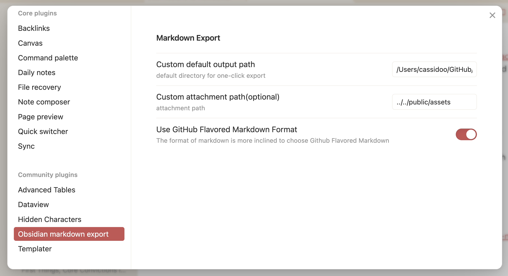

I like using [Obsidian](https://obsidian.md/) for almost everything writing-wise. But, this has caused occasional friction when it comes to publishing to my blog. I've mentioned before that [I'm trying out TinaCMS](https://blog.cassidoo.co/post/trying-tinacms/), which is generally working well for me (especially for posts with images), but I wanted to try something where I can push straight from Obsidian if I'm not able to use Tina for whatever reason.

The [repository for this blog](https://github.com/cassidoo/blahg) is separate from my Obsidian vault, so normally I have to do some copying and pasting across folders, which is _fine_ but really slows me down. I also checked out [Rach Smith's script for publishing to Astro from her vault](https://github.com/rachsmithcodes/obsidian-to-astro-sync), which works great, but not quite what I was hoping for.

After a little plugin hunting and configuring, I got something that'll work for me!

## Obsidian Markdown Export plugin

The [Obsidian Markdown Export plugin by @bingryan](https://github.com/bingryan/obsidian-markdown-export-plugin) takes your current note in Obsidian, and with a command can copy that note's markdown (or HTML!) into another folder on your machine, easily!

They actually didn't support "out of vault" files before (which I admit I didn't understand the use cases but eh), but [one GitHub issue later](https://github.com/bingryan/obsidian-markdown-export-plugin/issues/52), we're cookin!

Okay so the way this works is you go to **Settings > Community plugins** and then search + install **Obsidian Markdown Export**. From there in the plugin settings, you have to put in an **absolute** path for your external repository, and a **relative** path for your media assets.



So in my case, I put `/Users/cassidoo/GitHub/blahg/src/posts` for the markdown file to end up in my blog repo, and `../../public/assets` to put images in the folder relative to the outputted file.

## Templater

I use the [Templater](https://github.com/SilentVoid13/Templater) plugin mostly for [my newsletter](https://cassidoo.co/newsletter) and some other miscellaneous things not relevant here. I ended up making a "blog template" that I can use to quickly add the frontmatter I need!

Similar to the previous plugin, you can install Templater in the **Community Plugins** section of Obsidian, and then you can choose to configure it (I just added a `templates` folder to my vault for this).

My "blog template" looks like this:

```
---
layout: "../layouts/BlogPost.astro"
title: "<% tp.file.title %>"
slug: some-slug-example
description: "-"
added: "<% tp.file.creation_date('MMM DD YYYY') %>"
tags: [technical, advice, events, learning, meta, work, personal, musings]
---
```

Every blog in my repository needs to have this frontmatter, and the `tp.file.whatever` syntax is Templater's way of taking the file's metadata and inserting it when you plop in a template. So when I make a blog titled, "Publishing to my blog from Obsidian" (heyo), it populates that into the `tp.file.title` field, and it inserts the date under `added`.

The tags are just all the tags I have in my blog so far, and I usually just delete the ones that are irrelevant to the post and get writing.

## Mashing them all together

I wrote this blog post in Obsidian using these plugins, and I followed these steps!

1. Made a file titled "Publishing to my blog from Obsidian"
2. Inserted my "blog template" with Templater and wrote the blog
3. Ran the Markdown Export plugin
4. Navigated to my blog repo
5. `git commit -am "Wrote publishing from Obsidian post"`
6. `git push`
7. Donezo!

(As a quick side note: for all plugins in Obsidian, you can either click the buttons they have, or you run `Ctrl/Cmd+P` and then type in the name of the plugin, **or** you can set up hotkeys in the plugin's settings.)

Like my TinaCMS setup, it's not the most ergonomic thing in the world, but it's working well for me for now. I'm trying to embrace incremental changes more instead of trying to make everything instantly perfect, and this is definitely one of those smaller improvements that'll keep me going fast!
